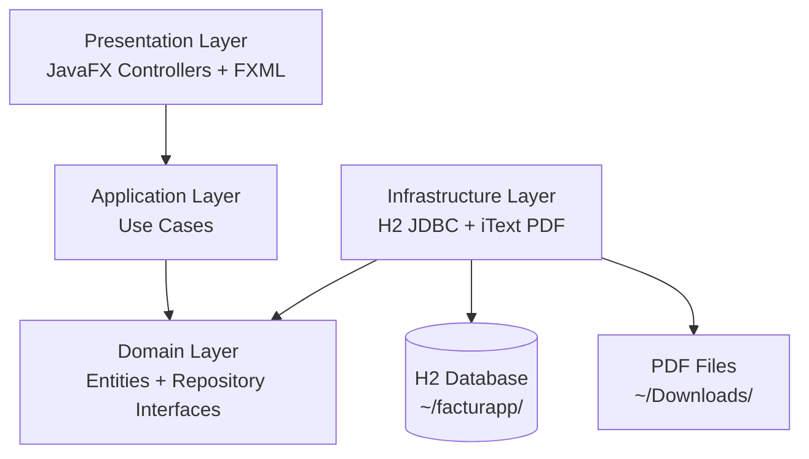

# LedgerFlow

**Sistema de Facturación Desktop** — Java 21 · JavaFX 21 · H2 · iText 8

Aplicación de escritorio para gestionar clientes, productos y facturas con generación automática de PDF. Funciona completamente offline con base de datos embebida.

    

---

## Características

- **Multi-empresa** — crea varias empresas emisoras y elige desde cuál emites cada factura
- **Clientes y Productos** — CRUD completo con búsqueda y filtros
- **Facturas** — líneas de detalle, descuentos por línea e IVA configurable (0 / 4 / 10 / 21 %)
- **PDF automático** — genera facturas con logo, datos de empresa, IBAN y notas al pie
- **Logos de empresa** — importa y gestiona imágenes para los PDFs
- **Estados de factura** — Borrador / Emitida / Pagada / Anulada
- **Usuarios con roles** — Admin / Usuario con login seguro (SHA-256)
- **Dashboard con KPIs** — clientes, productos, facturas y facturación del mes
- **Base de datos local** — H2 embebida, sin servidor, sin configuración

---

## Tecnología

| Capa | Tecnología |
|------|-----------|
| UI | JavaFX 21.0.2 + FXML |
| Persistencia | H2 2.2.224 (embebida, file-based) |
| PDF | iText 8.0.4 |
| Arquitectura | Clean Architecture |
| Build | Maven 3.9+ |
| Java | Java 21+ |

---

## Requisitos

- **Java 21+** — cualquier distribución con JavaFX (p.ej. [Liberica JDK Full](https://bell-sw.com/pages/downloads/), [Zulu FX](https://www.azul.com/downloads/?package=jdk-fx))
- **Maven 3.6+**

---

## Ejecución en desarrollo

```bash
git clone https://github.com/SuliAragon/LedgerFlow.git
cd LedgerFlow
mvn javafx:run
```

**Credenciales demo:**

| Usuario   | Contraseña | Rol     |
|-----------|-----------|---------|
| `admin`   | `admin123` | Admin   |
| `usuario` | `user123`  | Usuario |

> La base de datos se crea automáticamente en `~/facturapp/facturapp_db.mv.db`
> Los PDFs se guardan en `~/Downloads/FAC-XXXX-XXXX.pdf`

---

## Generar instaladores

### macOS (.dmg)

```bash
./build-mac.sh
# → target/installer/LedgerFlow-1.0.0.dmg
```

### Windows (.exe)

```bat
build-windows.bat
:: Requiere JDK 17+ y WiX Toolset 3.x
:: → target\installer\LedgerFlow-1.0.0.exe
```

### GitHub Actions (automático)

Cada push a `main` genera ambos instaladores automáticamente. Descárgalos desde la pestaña **Actions → último workflow → Artifacts**.

---

## Arquitectura

```
src/main/java/com/facturapp/
├── domain/
│   ├── model/          # Entidades: Factura, Cliente, Producto, EmpresaConfig…
│   └── repository/     # Interfaces de repositorio (puertos)
├── application/        # Casos de uso (FacturaUseCase, ClienteUseCase…)
├── infrastructure/
│   ├── config/         # DatabaseConfig (H2, schema init)
│   ├── pdf/            # PdfFacturaGenerator (iText 8)
│   └── persistence/    # Repositorios JDBC
└── presentation/
    ├── controller/     # Controladores JavaFX
    └── util/           # AppContext (DI manual), SessionManager, AlertUtil

src/main/resources/
├── com/facturapp/
│   ├── fxml/           # Vistas FXML
│   └── css/            # Estilos (paleta slate + blue accent)
└── database/
    ├── schema.sql      # DDL — CREATE TABLE IF NOT EXISTS
    └── demo_data.sql   # Datos de demostración
```

---

## Diagrama de arquitectura



---

## Licencia

MIT License — libre para uso personal y comercial.
